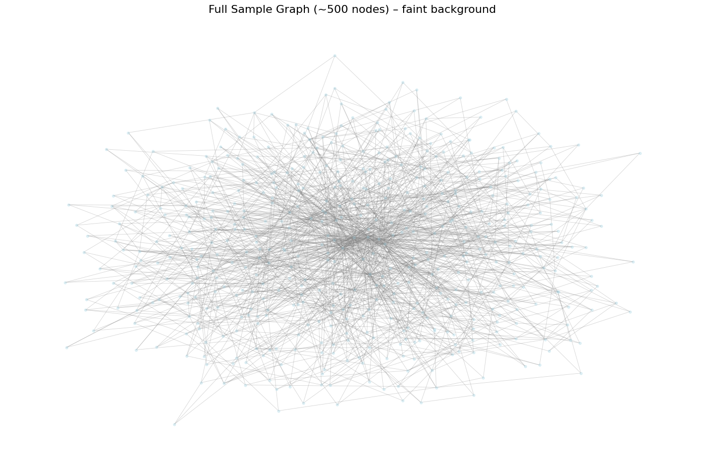
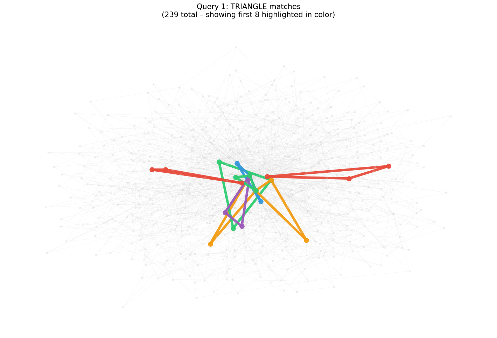
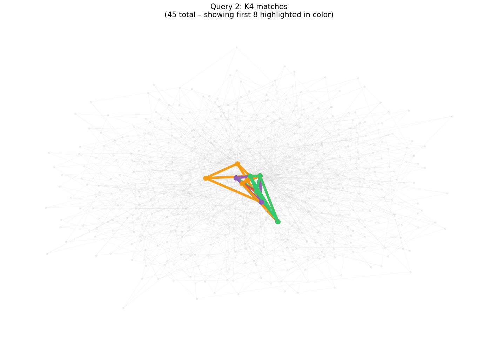

# G-ThinkerQ Demo  
**Task-Based Online Subgraph Querying in Action**

)

---

### 📸 Live Demo Screenshots

**Full Sample Graph** (~500 nodes, scale-free with planted K₇)  

**Query 1 – Triangle Matches** (239 total – first 8 highlighted)  

**Query 2 – K₄ Matches** (45 total – first 8 highlighted)  

---

## Experience the Future of Subgraph Querying

This clean, high-impact Google Colab notebook brings **Professor Guimu Guo’s G-ThinkerQ** and its groundbreaking **Think-Like-A-Task (TLAT)** model directly into your browser.

Watch subgraph queries arrive **online**, get instantly decomposed into independent tasks, and be fairly scheduled on limited simulated cores — exactly like real distributed systems.

**Why this demo stands out:**
- Runs in **under 15 seconds** on free Colab
- Uses only pre-installed libraries (`networkx`, `matplotlib`, `tqdm`)
- Real task decomposition + FIFO fairness + live progress
- Stunning visualizations that clearly show every match
- Perfect for teaching, research talks, and portfolio demos

---

## ✨ Core Capabilities

- **Online Query Arrival** – Submit new queries while previous ones are still running  
- **TLAT-Style Decomposition** – Each query becomes 20 independent, parallelizable tasks  
- **Fair FIFO Scheduler** – Simulated 5-core limit with true fairness  
- **Live Monitoring** – Real-time tqdm + per-query progress percentage  
- **Instant Visual Feedback** – Beautifully highlighted triangles and 4-cliques  
- **Teaching-Ready** – Only 9 perfectly organized cells with rich comments  

---

## 🚀 One-Click Start

**Just click the badge above** → **Runtime → Run all**

Try adding more queries in Cell 7 to see true online behavior in action.

---

## Notebook at a Glance

| Cell | Purpose                              |
|------|--------------------------------------|
| 1    | Title & G-ThinkerQ inspiration       |
| 2    | Imports                              |
| 3    | 500-node graph + planted K₇          |
| 4    | Query → 20 tasks decomposition       |
| 5    | Triangle & K₄ matching logic         |
| 6    | FIFO scheduler (5-core simulation)   |
| 7    | Submit multiple online queries       |
| 8    | High-quality match visualizations    |
| 9    | Conclusion & real-system connection  |

---

## Built for Impact

Created to help students, researchers, and professors **see and feel** how modern subgraph querying systems actually work under the hood.

Directly inspired by:  
**“G-ThinkerQ: Task-based Online Subgraph Querying”**  
Professor Guimu Guo et al. (IEEE TKDE 2025)

---

**⭐ Star this repository** if it helped you understand task-based querying or if you plan to use it in your class, talk, or project.

Fork it. Extend it. Teach with it.

**Made with passion for graph computing education.**
